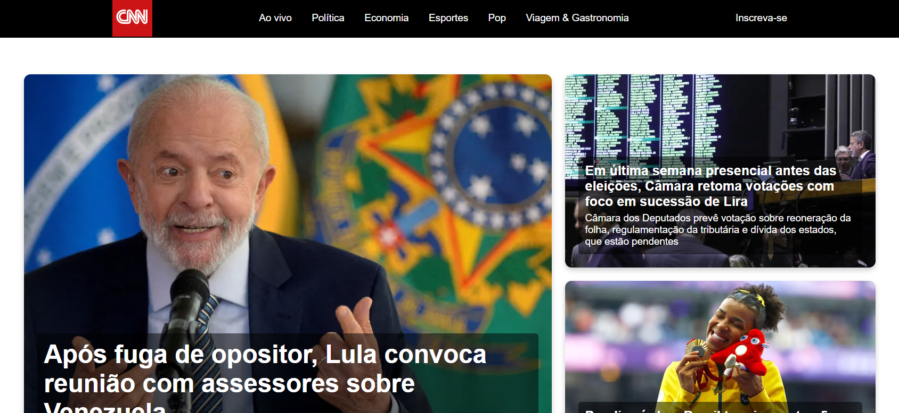

# Trabalho 1: Portal de Notícias

> O projeto envolve a criação de um site de notícias inspirado na CNN, com detalhamento das matérias e um formulário de inscrição, como parte da disciplina de Web 1.

## 🔧 Tecnologias Utilizadas

No desenvolvimento deste projeto, foram utilizadas as seguintes tecnologias:

## 🤝 Colaboradores

Agradecemos às seguintes pessoas que contribuíram para este projeto:

<table>
  <tr>
    <td align="center">
      <a href="https://github.com/pbgollo" title="Perfil do Pedro Gollo no GitHub">
         
        
          <b>Pedro Gollo</b>
        
      </a>
    </td>
    <td align="center">
      <a href="https://github.com/FasterThanM" title="Perfil do Franco no GitHub">
         
        
          <b>Franco Michelon</b>
        
      </a>
    </td>
  </tr>
</table>
